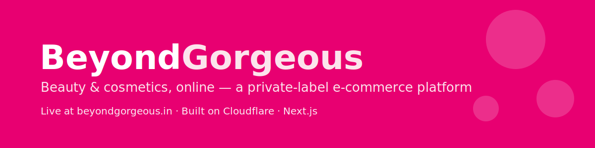
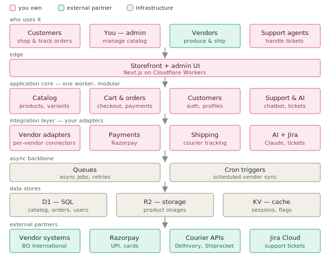

<p align="center">
  
</p>

<h1 align="center">BeyondGorgeous</h1>

<p align="center">
  A private-label beauty &amp; cosmetics e-commerce platform — designed to scale from a single brand to a multi-vendor marketplace.
</p>

<p align="center">
  
  
  
  
  
</p>

---

## 🌸 Overview

**BeyondGorgeous** is a beauty e-commerce brand. Version 1 — a fast, responsive, Nykaa-inspired storefront — is **live at [beyondgorgeous.in](https://beyondgorgeous.in)**, deployed on Cloudflare. Version 2 turns it into a full transactional store with a vendor-fulfilled supply chain, ERP-grade inventory, AI customer support, and a marketplace-ready foundation.

This repository contains the storefront code **and** a complete, versioned design programme for what comes next.

| | |
|---|---|
| 🔗 **Live site** | [beyondgorgeous.in](https://beyondgorgeous.in) · [www](https://www.beyondgorgeous.in) |
| 🧱 **Tech stack** | Next.js (App Router), React 19, TypeScript, Tailwind CSS, Cloudflare Workers |
| 🎨 **Design language** | Nykaa-inspired, pink (`#E80071`), mobile-first |
| 📐 **Design spec** | v0.4.0 (see documentation below) |

---

## 📚 Documentation

> Everything a stakeholder or developer needs, in one place.

| Document | What it is |
|----------|------------|
| 📖 **[Technical Overview](docs/TECHNICAL-OVERVIEW.md)** | A readable, presentable summary of the architecture, subsystems, and roadmap. **Start here.** |
| 🏛️ **[Architecture Specification](docs/ARCHITECTURE.md)** | The full, versioned technical reference (26 sections) — the deep spec. |
| 🖼️ **[UI Mockups](docs/UI-Mockups.html)** | Wireframes for every screen + branded hero designs. *Download and open in a browser.* |
| 📄 **[Design &amp; Roadmap (Word)](docs/BeyondGorgeous-Design-and-Roadmap.docx)** | Project-manager-grade document: scope, milestones, risks, sign-off plan. *Download to view.* |

---

## 🏗️ Architecture at a glance

<p align="center">
  
</p>

A **modular monolith** on Cloudflare — one clean, well-bounded application rather than a sprawl of microservices. Built around a single principle: **every piece of data has one owner**, so vendor stock and pricing flow in automatically while the brand owns content and price.

---

## ✨ What it does (and will do)

- 🛍️ **Storefront** — catalog, categories, product pages, cart, search *(live: catalog & browsing)*
- 🤝 **Vendor-fulfilled supply** — multiple suppliers via API, spreadsheet, or email; dropship **and** self-fulfilled
- 📦 **ERP-grade inventory** — stock ledger, batch/expiry (FEFO), automated reordering
- 💳 **India-first checkout** — UPI, cards, **cash-on-delivery**, phone-OTP login, guest checkout
- 🧾 **Compliant by design** — GST invoicing, return/refund policies, data-protection (DPDP)
- 🤖 **AI customer support** — chatbot with escalation to Jira
- 🏬 **Marketplace-ready** — open to third-party sellers later with no rebuild

---

## 🗺️ Roadmap

| Phase | Focus |
|-------|-------|
| **0** | Foundations — environments, CI/CD, testing, security |
| **1** | Catalog & admin |
| **2** | Customer accounts &amp; cart |
| **3** | Checkout, payments &amp; tax |
| **4** | Fulfillment &amp; vendor automation |
| **5** | Reviews, content &amp; AI support |
| **6** | Inventory &amp; replenishment (ERP) |
| **7** | Marketplace *(future)* |

Full detail, milestones, and client sign-off gates are in the [design documents](#-documentation).

---

## 🚀 Running locally

```bash
npm install
npm run dev
```

Then open [http://localhost:3000](http://localhost:3000).

---

<p align="center"><sub>© BeyondGorgeous · Built with Next.js on Cloudflare</sub></p>
